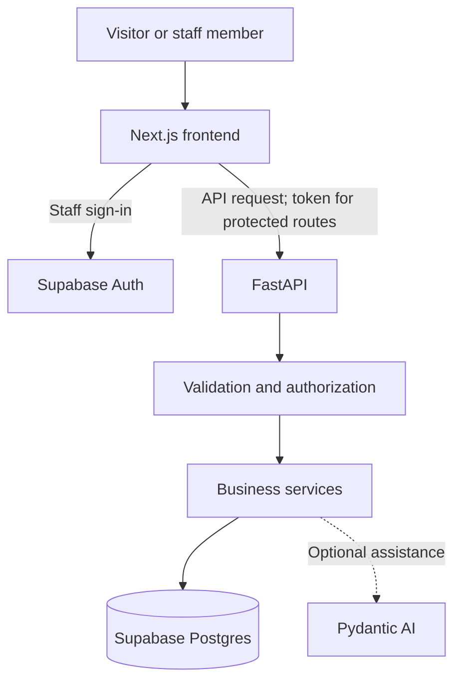

# Montrose Center

A resource and referral platform supporting Houston's LGBTQ+ community. The MVP helps people find services, lets staff coordinate referrals, and gives administrators a way to keep service information current.

**Status: descriptive scaffold only.** Files contain brief descriptions of their intended responsibilities. This is not a runnable application yet: dependencies, application code, database schema, and authentication remain to be implemented.

## Stack

| Layer | Technology | Responsibility |
| --- | --- | --- |
| Frontend | Next.js + TypeScript | Public directory and staff/admin interfaces |
| Backend | Python + FastAPI | API, permissions, referral rules, and reporting |
| Validation | Pydantic | Request and response models |
| Data and authentication | Supabase Postgres + Auth | Persistence, staff identity, and row-level security |
| Optional assistant | Pydantic AI | Service-finding assistance and permitted backend tools |

## Repository structure

```text
apps/
  web/
    src/app/(public)/       Public service directory
    src/app/staff/          Staff referral workspace
    src/app/admin/          Service administration
    src/components/        Shared accessible UI
    src/lib/               API client and Supabase session clients
    src/types/             Generated database types
    package.json           Placeholder frontend manifest
    .env.example           Public frontend configuration template
  api/
    app/main.py            Future FastAPI entry point
    app/routers/           HTTP endpoints
    app/schemas/           Pydantic request/response models
    app/services/          Business rules
    app/repositories/      Database access
    app/agents/            Optional Pydantic AI assistant
    app/core/              Configuration, authentication, permissions
    tests/                 Backend behavior and authorization tests
    pyproject.toml         Placeholder Python project metadata
    .env.example           Backend configuration template
supabase/
  config.toml              Placeholder local configuration
  migrations/              Versioned schema and RLS policies
  seed.sql                 Fictional development data
  tests/                   Database permission tests
docs/                      Scope, architecture, workflows, and handoff
.github/workflows/ci.yml    Manual placeholder workflow
```

Next.js route groups such as `(public)` organize files without adding a URL segment. The proposed public directory lives at `/`, with staff and administration at `/staff` and `/admin`. Authentication and authorization still need implementation.

## How the application will work



Public users browse published services without an account. Staff sign in through Supabase Auth. FastAPI validates protected requests and applies permissions before accessing data. Keep referral rules and service publishing logic in FastAPI rather than duplicating them in Next.js.

RLS policies belong in migrations. Privileged database credentials bypass RLS, so they must never appear in browser code and must not substitute for backend authorization.

## Getting started with this scaffold

1. Read [the project brief](docs/project-brief.md), [architecture](docs/architecture.md), and [data boundaries](docs/data-boundaries.md).
2. Install Git, Node.js with npm, Python, and the Supabase CLI. A local Supabase stack also needs a compatible container runtime. Pin supported versions when initializing the applications.
3. Prepare local environment files from the repository root:

   ```sh
   cp apps/web/.env.example apps/web/.env.local
   cp apps/api/.env.example apps/api/.env
   ```

   Fill in local development configuration when a Supabase project exists. These files are ignored by Git. Backend environment loading is not implemented yet.
4. Initialize Next.js and TypeScript in `apps/web`, preserving or replacing the descriptive placeholders intentionally. Add dependencies, scripts, and a package lockfile.
5. Configure the Python project in `apps/api`, add FastAPI and Pydantic dependencies, implement `app.main:app`, and commit the chosen dependency lockfile. Add Pydantic AI when the assistant is implemented.
6. Replace the placeholder Supabase configuration with CLI-generated configuration. Add schema and RLS migrations, then fictional seed data.
7. Add meaningful frontend, backend, and database permission checks to CI. The current workflow only displays a scaffold notice and runs manually.

**There are no working install, development-server, or test commands configured yet.** Update this README with exact commands and pinned prerequisites as part of application initialization. Comment-only page files do not export working Next.js pages, and `main.py` does not yet define a FastAPI app.

## Build order

1. Initialize the applications, local configuration, and CI.
2. Implement service tables, permissions, and admin publishing.
3. Show published services in the public directory.
4. Implement the agreed referral workflow with fictional clients and authorization tests.
5. Add reporting based on agreed baseline metrics and document operations.
6. Add the optional assistant, community features, or Summit experience after the must-haves. Confirm the Summit year before planning around February 7–8.

## Working agreements

- Commit schema and permission changes under `supabase/migrations`.
- Use fictional records in seeds, tests, demos, and screenshots.
- Keep secrets, real client information, and production database exports out of Git.
- Validate permissions on the backend and test denied access paths.
- Agree on the record-system boundary and production requirements with the Center before using real client data.
- Keep setup and handoff instructions current as working code replaces placeholders.

## Project documentation

- [Project brief and scope](docs/project-brief.md)
- [Architecture and request flow](docs/architecture.md)
- [Client data boundaries and open decisions](docs/data-boundaries.md)
- [Directory and referral workflows](docs/workflows.md)
- [Success metrics](docs/success-metrics.md)
- [Handoff and operations](docs/handoff.md)
